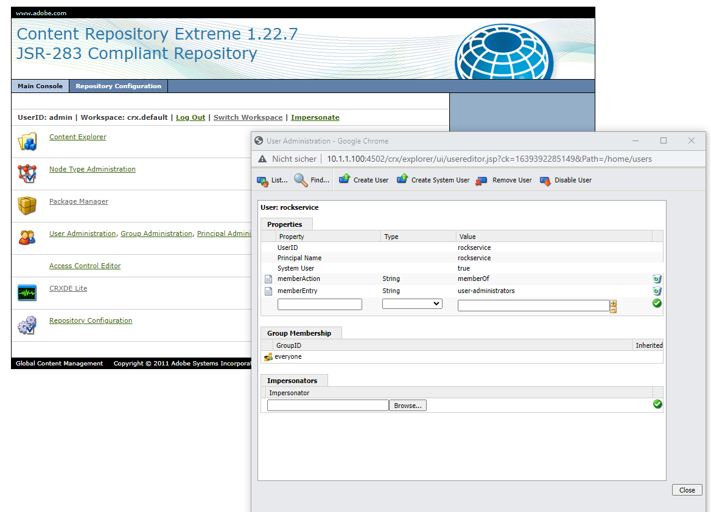
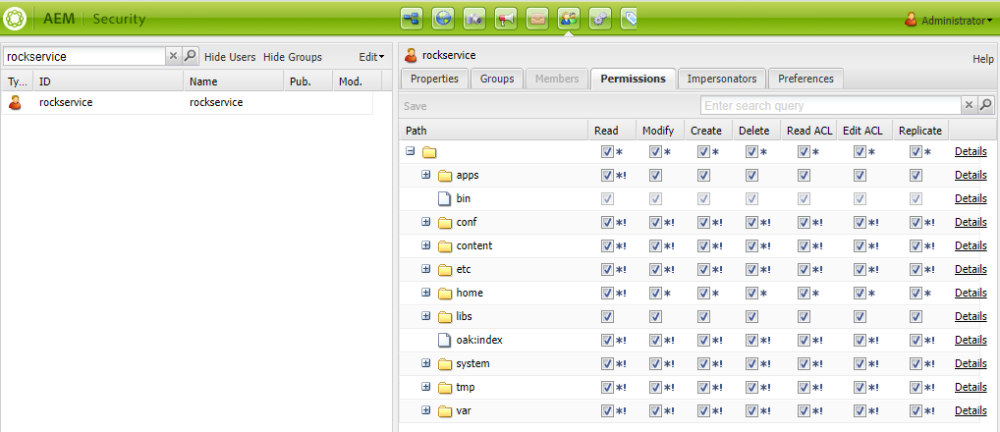
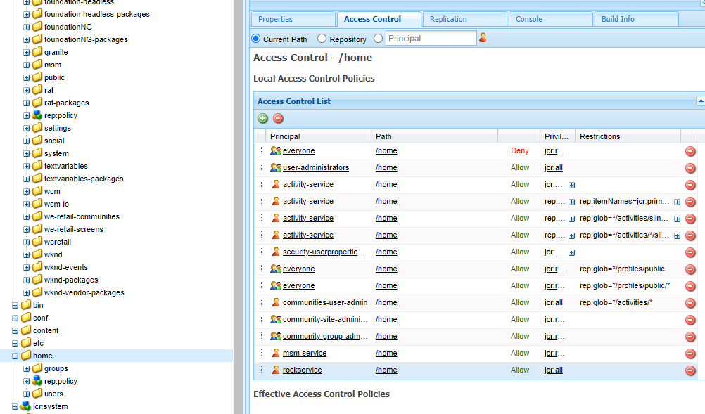
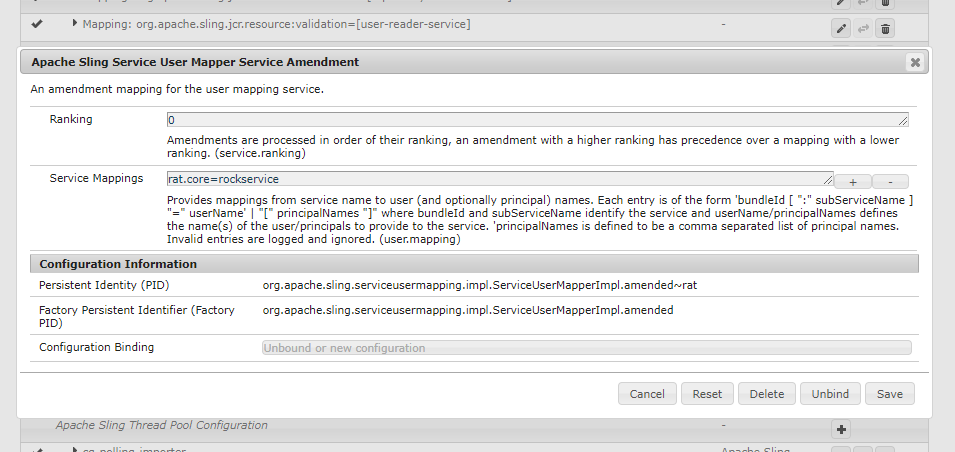
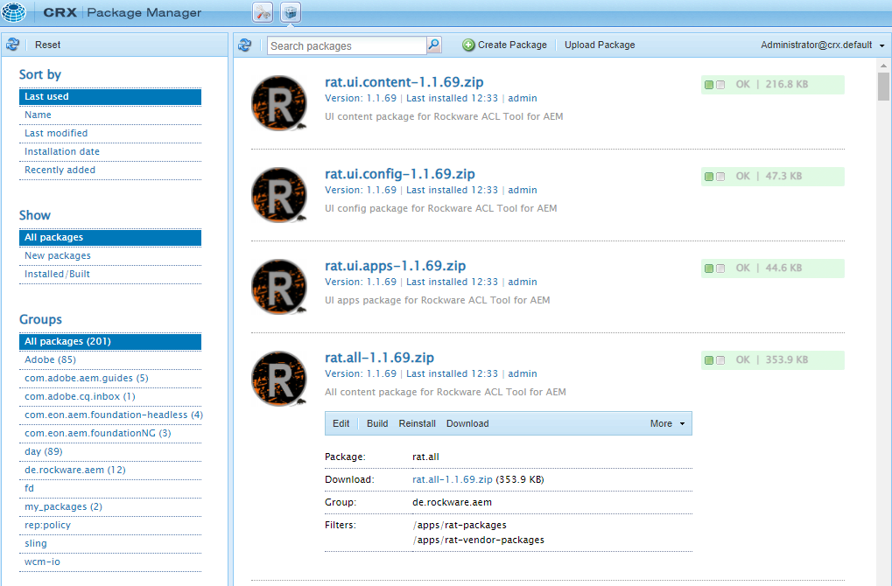
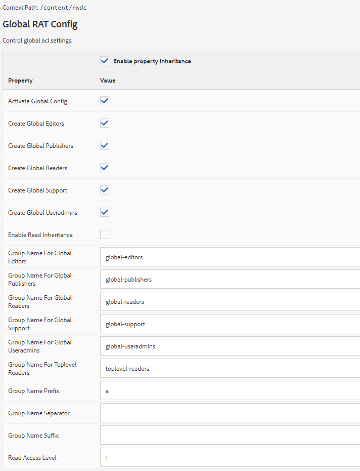
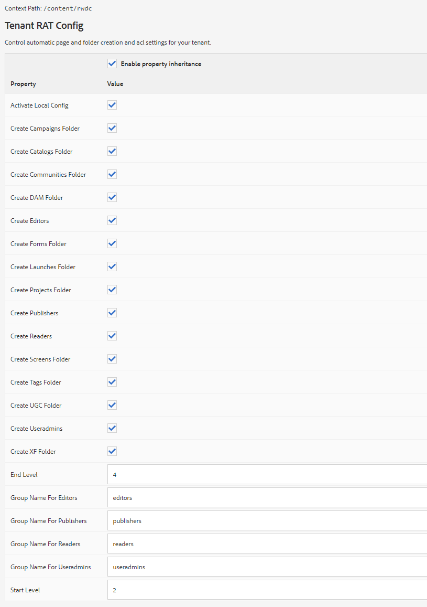

# 
# rat - Rockware Acl Tool for AEM

## Another ACL Tool? Why?
There are already several ACL tools available for AEM. Some create groups and set ac properties based on YAML files, others copy rules from A to B. rat is using a different approach.

### Very short summary
You tell rat in a CaConfig which groups you would like to have. Then - whenver you add a page in AEM - rat makes sure that those groups are available throughout the content
hierarchy. It also adds AC settings, makes sure that group inheritance is working fine and creates additional folders so that your site structure is consistent.

### Walkthrough by examples
#### 1. Preparations
##### a) Create a service user (optional)
You might have a service user at hand that has the following rights:
* read access to the repository
* jcr:all to /home/groups (needs to be set in the crx/de manually) -> because the user will create and modify groups
* jcr:all to /content -> setting permissions in the content tree requires those rights to be in place

If not, open the crx explorer to create the user. We will create a user _**rockservice**_ in this example case.

Then set the correct rights in /useradmin.

Explicitly add permissions for /home in crx/de (we choose jcr:all for the sake of simplicity here).

Finally add a **_Apache Sling Service User Mapper Service Amendment_**.

Now we have a system user that is able to create new groups and modify existing ones as well as add ACL information to resources in the
repository.

#### 2. Install the package
Take the current version from [github](https://github.com/rockwareGmbHCoKG/rat/releases) and install it in AEM using the package manager.
After the installation is complete you should see four packages on your machine.

#### 3. Add the global config
The global config needs to be edited in order to tell RAT 
* which **_global_** groups should be created
* what their names (with prefix and suffix) should be
* if read inheritance should be enabled (access to a page automatically gives read access to all subpages)
* the read access level

#### 4. Add the tenant config
The tenant config controls tenant specific settings, for example which folders should be created if a new tenant is created.

For example, if you create a page /content/demo/de, RAT can automatically create /content/dam/demo/de, 
/content/experiecne-fragments/demo/de and more, it will ensure that parent folders do exist as well and in the end
if will even set the correct ACLs to all of these folders.

#### 5. Create a page
#### 6. Check groups
#### 7. Check new content nodes
#### 8. Check permissions.
#### 9. Be happy 

